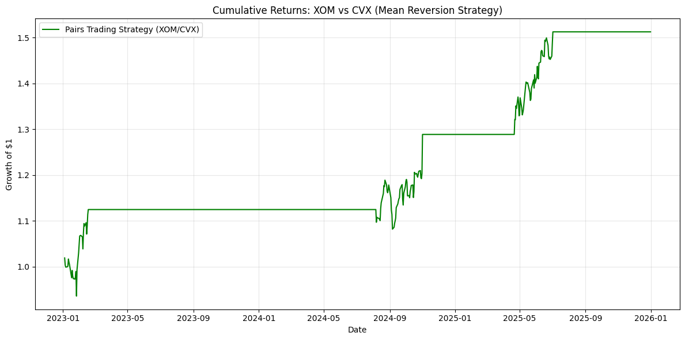

# energy-quant-trading
A statistical arbitrage strategy using cointegration to trade US energy pairs (XOM/CVX).
# Energy Sector Statistical Arbitrage (Pairs Trading)

This project implements a quantitative mean-reversion strategy focused on the US Energy sector. Specifically, it analyzes the relationship between **Exxon Mobil (XOM)** and **Chevron (CVX)**.

## Performance Metrics (2023 - 2026)
Based on backtesting results, the strategy achieved:
* **Annualized Return:** 14.53%
* **Sharpe Ratio:** 1.27
* **Max Drawdown:** -9.00%
* **Calmar Ratio:** 1.61

## How it Works
1. **Cointegration:** Uses the Engle-Granger test to find "tethered" price pairs.
2. **Z-Score Signals:** Enters trades when the price spread deviates by 2 standard deviations.
3. **Risk Management:** Includes automated exit signals and drawdown monitoring.

## How to Run
1. Install dependencies: `pip install -r requirements.txt`
2. Run the backtest: `python pairs_trading.py`

